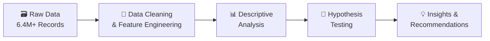

<div align="center">

<!-- Banner -->


<br/>

[](https://www.python.org/)
[](https://pandas.pydata.org/)
[](https://scipy.org/)
[](https://matplotlib.org/)
[](https://www.statsmodels.org/)

<br/>

> **Smarter insights. Better decisions. Higher earnings.**

<br/>


</div>

---

## 📌 Table of Contents

- [Overview](#-overview)
- [Research Questions](#-research-questions)
- [Dataset](#-dataset)
- [Methodology](#-methodology)
- [Key Findings](#-key-findings)
- [Hypothesis Testing](#-hypothesis-testing)
- [Recommendations](#-recommendations)
- [Tech Stack](#-tech-stack)
- [Project Structure](#-project-structure)

---

## 🚖 Overview

The taxi booking industry relies on **data-driven decisions** to maximise driver earnings and improve operational efficiency. This project analyses the relationship between **payment methods** and **fare amounts** using a dataset of **6.4+ million NYC taxi trip records** to identify patterns that influence revenue.

The insights help answer whether payment type affects fare pricing and support strategies for **maximising driver revenue** without compromising customer satisfaction.

---

## ❓ Research Questions

```
1. To what extent does the payment method impact the total fare collected?

2. Can strategic payment preferences be promoted to enhance driver revenue
   without affecting customer satisfaction?
```

---

## 📂 Dataset

**Source:** NYC Taxi Trip Dataset (6.4+ million records)

The dataset was cleaned and feature-engineered, retaining the following columns:

| Column | Description |
|--------|-------------|
| `passenger_count` | Number of passengers (1–5) |
| `payment_type` | Card or Cash |
| `fare_amount` | Total fare in USD |
| `trip_distance` | Distance in miles |
| `duration` | Trip duration in minutes *(derived feature)* |

> 🔧 `duration` was engineered as: `tpep_dropoff_datetime − tpep_pickup_datetime`

---

## 🔬 Methodology



| Step | Technique | Description |
|------|-----------|-------------|
| **1** | 🧹 Data Cleaning | Removed nulls, filtered outliers, retained relevant columns |
| **2** | 📊 Descriptive Analysis | Explored fare amounts, trip durations, and payment distributions |
| **3** | 🧪 Hypothesis Testing | Independent two-sample T-test on payment type vs. fare amount |
| **4** | 📈 Visualization | Distribution plots, pie charts, and passenger count breakdowns |

---

## 📊 Key Findings

### 💳 Payment Type Preference

<div align="center">

| Payment Method | Share of Transactions |
|:--------------:|:---------------------:|
| 💳 Card | **67.5%** |
| 💵 Cash | **32.5%** |

</div>

> Card payments dominate customer transactions, reflecting a strong customer preference for **digital, cashless experiences**.

---

### 🚕 Journey Insights

- 💳 **Card users** show a **higher average fare amount and trip distance** than cash users
- Customers are more likely to choose card payments for **longer, higher-value trips**
- Digital payment users represent **greater revenue potential** for drivers

---

### 👤 Passenger Count Breakdown

| Payment Type | 1 Passenger | 2 Passengers | 3+ Passengers |
|:------------:|:-----------:|:------------:|:-------------:|
| 💳 Card | 40.08% | 14% | ~13% |
| 💵 Cash | 20.04% | 7% | ~5% |

> **Solo travellers** are the dominant customer segment across all payment types.
> Trip frequency decreases as group size increases — larger groups prefer alternative transport.

---

## 🧪 Hypothesis Testing

```
H₀ (Null Hypothesis):     There is NO significant difference in average fare
                          between card and cash payments.

H₁ (Alternate Hypothesis): There IS a significant difference in average fare
                            between card and cash payments.
```

### Results

<div align="center">

| Metric | Value |
|:------:|:-----:|
| **Test Used** | Independent Two-Sample T-Test |
| **T-Statistic** | `169.21` |
| **P-Value** | `< 0.05` |
| **Decision** | ✅ Reject H₀ |

</div>

> **Conclusion:** There is a **statistically significant difference** in average fares between card and cash payments. Payment type is a meaningful factor in **customer spending behaviour** and should be central to revenue optimisation strategies.

---

## 💡 Recommendations

```
┌─────────────────────────────────────────────────────────────────┐
│  💳  Encourage Card Payments                                     │
│      Card transactions → higher fares + longer trips            │
│      = greater revenue for drivers                               │
├─────────────────────────────────────────────────────────────────┤
│  🎁  Introduce Digital Payment Incentives                        │
│      Cashback, discounts, or loyalty rewards                     │
│      to nudge customers toward card payments                     │
├─────────────────────────────────────────────────────────────────┤
│  ⚡  Enhance Digital Payment Experience                          │
│      Fast, secure, seamless card payment options                 │
│      to boost satisfaction and revenue simultaneously            │
└─────────────────────────────────────────────────────────────────┘
```

---

## 🛠️ Tech Stack

<div align="center">

| Tool | Purpose |
|------|---------|
|  | Core programming language |
|  | Data manipulation & analysis |
|  | Data visualization & plotting |
|  | Statistical tests & distributions |
|  | Statistical modelling & inference |

</div>

---

## 📁 Project Structure

```
📦 maximising-revenue-for-drivers
├── 📂 data/
│   └── nyc_taxi_trips.csv          # Raw dataset (6.4M+ records)
├── 📂 notebooks/
│   └── analysis.ipynb              # Full EDA + Hypothesis Testing
├── 📂 outputs/
│   ├── fare_distribution.png       # Fare distribution by payment type
│   ├── trip_distance_dist.png      # Trip distance distribution
│   └── payment_preference.png     # Pie chart of payment type share
├── 📂 reports/
│   └── Maximising_Revenue.pdf      # Final project report
├── requirements.txt
└── README.md
```

---

<div align="center">


*Built with ❤️ using Python & NYC Open Data*

</div>
